# Sistema de Ocorrências Acadêmicas
AED2 — Projeto Integrador

---

## Grupo

Gian Garima

Gabriel Soares

Hernane Lemes

## Como rodar

Precisa ter Python 3 instalado. Sem bibliotecas externas.

```bash
python gerenciamento_ocorrencias.py
```

---

## O que o sistema faz

- Cadastrar ocorrências com nome, tipo, descrição e prioridade
- Listar, buscar por ID, nome ou tipo
- Atender pela ordem de chegada (fila)
- Ver e desfazer ações do histórico
- Ordenar por prioridade
- Salvar e carregar histórico em arquivo .txt

---

## Perguntas obrigatórias

**Onde foi usada a fila?**
Na `fila_atendimento`. Cada ocorrência cadastrada entra no final da fila, e a opção 10 atende a primeira da fila (FIFO) usando `.pop(0)`.

**Onde foi usada a pilha?**
No `historico`. Cada cadastro e atendimento é empilhado com `.append()`. O desfazer (opção 8) remove o último registro com `.pop()` (LIFO).

**Onde foi usada a árvore?**
Não implementamos árvore. A busca por ID percorre a lista diretamente. Ficamos na versão mínima aceitável do enunciado, que não exige árvore.

**Onde foi usada a heap?**
Também não implementamos. A ordenação por prioridade (Bubble Sort, opção 11) cobre a visualização por prioridade, mas sem heap de fato.

**Onde foi usada a hash table?**
Em duas tabelas: `hash_nome` e `hash_tipo`. A chave é o nome ou tipo em minúsculo, e o valor é uma lista de ocorrências. As buscas nas opções 4 e 5 acessam direto pela chave, sem varrer a lista inteira.

**Qual algoritmo de ordenação foi implementado?**
Bubble Sort, feito manualmente na função `ordenar_por_prioridade()`. Compara pares adjacentes e troca até ordenar do maior para o menor.

**Qual estrutura foi mais adequada para busca rápida?**
A hash table. Acessa o resultado direto pela chave (O(1)), enquanto a busca na lista percorre tudo (O(n)).

**Qual estrutura foi mais adequada para atendimento por prioridade?**
A heap seria o ideal, mas não chegamos a implementar. O Bubble Sort resolve pra visualização, mas não automatiza o atendimento por prioridade.

**Qual foi a maior dificuldade do grupo?**
Como precisamos utilizar diversas estruturas diferentes, a maior dificuldade que tivemos foi decidir qual era a melhor para cada situação.

Menu:

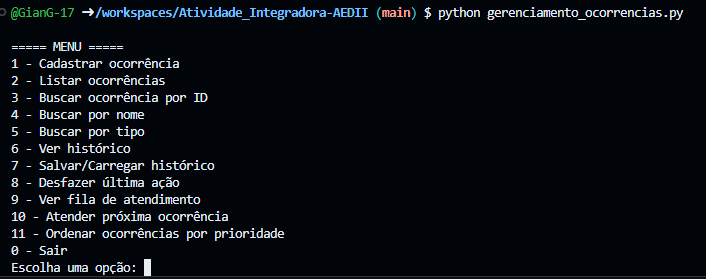

Cadastrar ocorrência: 

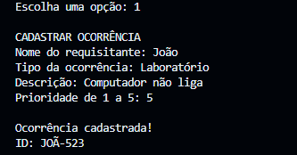

Listar ocorrências:

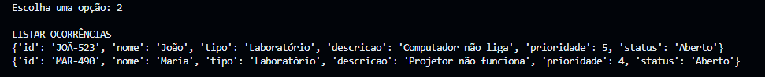]

Buscar ocorrências por ID:

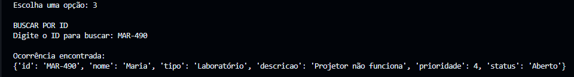

Buscar por nome:

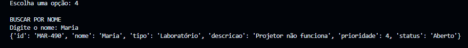

Buscar por tipo:

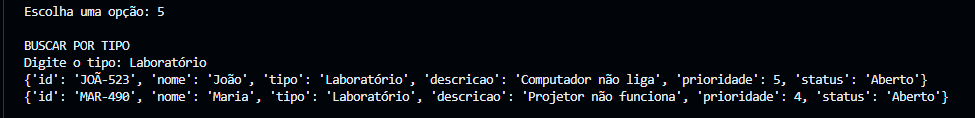

Ver histórico:

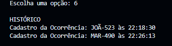

Salvar histórico:

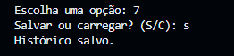

Carregar histórico:

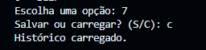

Desfazer última ação:

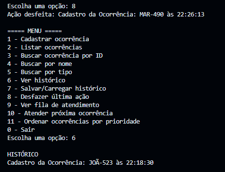

Ver fila de atendimento:


Atender próxima ocorrência:

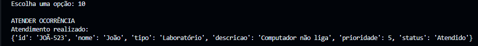

Ordenar ocorências por prioridade:

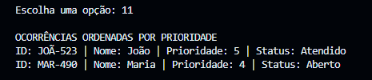